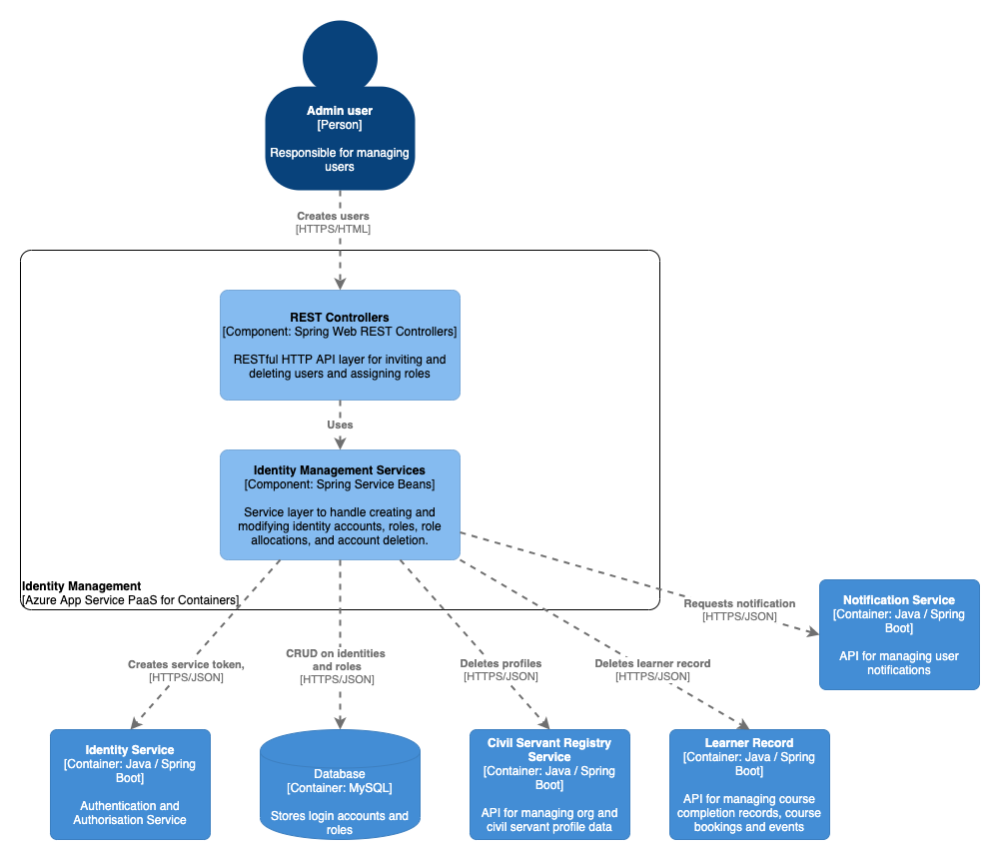

# Identity Management

## Purpose

A Spring Boot & Bootstrap based web app for identity administrators to manage user accounts, invites and roles. Account and role data is stored in MySQL. Identity Management also issues calls to Learner Record and CSRS when deleting an account, to ensure that the user's profile and learner record entries are also deleted. Unlike the LPG-UI or LPG-Management apps, this application uses a default bootstrap theme rather than the GOV.UK Frontend.

## Component overview

See the `diagram/` folder for diagram source in draw.io XML format

## Dependencies

### Build-time

For a complete list of build dependencies check the `pom.xml` file. The main source dependencies are:  
- Spring Boot 1.5 (cloud, web, security, oauth2)
- Spring Data JPA
- Azure App Insights 2.5
- AspectJ 1.9
- h2 1.4
- Hibernate 5.4.2
- Mysql connector 8.0

### Test-time

For a complete list of test dependencies check the `pom.xml` file. The main test dependencies are:  
- Spring Boot Starter Test
- Spring Boot Security Test
- mockito 2.8
- powermock 1.7

### Runtime 

#### Other LPG Services

- `identity-service` for OAuth token validation on all requests
- `civil-servant-registry-service` for deleting profiles when deleting user accounts
- `learner-record` for deleting learner records when deleting user accounts
- `notification-service` for requesting invite, account suspended and account deleted notifications to users

#### External integrations

- none

#### Data Stores

- MySQL <version> for CRUD actions on identity accounts and role data

#### Data migrations

None, but the identity-management service uses the same data store as identity-service which manages all DB migrations on the identity schema. If a change in schema or data is required then the DB migration script must be applied there.

## Build, run, test, deploy

The application requires Java 8 (OpenJDK 8) installed to build and run.

Build the application using Maven `mvn compile`.

Run the project with `mvn spring-boot:run` or import the project into your IDE of choice such as IntelliJ or VS Code use the IDE commands to Run Application.

Run the unit tests using `mvn test` or choose individual test classes or packages using your IDE.

The application is packaged as a docker container image - see `Dockerfile` in the root directory for the container definition. `hammer` is the log collector used for aggregating log output.

The application also inclues a `Jenkinsfile` to define the Jenkins build pipeline stages and linking it to the docker image repository and correct terraform module.

Deployment is controlled via the Terraform scripts in the main PaaS repository, with per-environment configuration values referenced there and secrets injected from keybase.

## Configuration

Significant configuration properties are highlighted here. For the full configuration file see `src/main/resources/application.yml`

- `oauth` connection settings for the identity-service used to validate bearer tokens
- `spring.datasource` connection settings for MySQL database
- `invite` path and validity settings for the invite link to send to new users
- `learnerRecord` connection settings for the learner-record service
- `csrs` connection settings for the civil-servant-registry service
- `notifications` connection settings for the notification service
- `govNotify` GOV.UK Notify template references to pass to the notification service

## Licenses

Identity Management is licensed by the MIT license, see `LICENSE` in the root folder for details. Dependent applications are licensed as according to their respective readme and license files.
